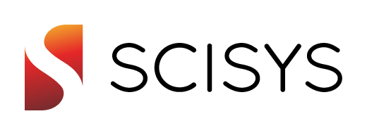

## [FOSS4G UK 2016](/foss4guk2016/) : Sponsors

We want to keep the cost of entry to FOSS4G UK as low as possible - sponsorship will help us to do that. If you are interested in sponsoring FOSS4GUK, there are opportunities for the smallest to the largest companies, and even for one man bands. To find out about sponsorship, send Steven a message via [http://knowwhereconsulting.co.uk/contact/](http://knowwhereconsulting.co.uk/contact/).

FOSS4G UK thanks our generous sponsors.

---

 

Ordnance Survey is Britain’s mapping agency responsible for maintaining one of the world’s largest and most accurate geospatial databases. From the database, consisting of 500 million features, OS produces a range of intelligent products and services which are used by business, government and consumers. OS also supports Open Data through the release of a number of datasets and licenses allowing developers to freely use location data. In addition OS is focussed on enabling people to use open location data, demonstrated through the Geovation Challenges over the last five years and the opening of the Geovation Hub in 2015.

---

 

At [Astun](http://www.astuntechnology.com) we are passionate about geography and passionate about open (source, standards and data), and to be honest we are a bit geeky. We believe that the power of geography can enable our clients to manage assets more efficiently, inform better decisions, improve services and drive down costs. We want to help you to realise those benefits via an open and transparent business model that does not penalise clients when their demand increases or needs change, and which allows us to run a successful and sustainable business.

We believe that open source is a game changer within our industry that delivers robust, scalable technology, and market leading value through a collaborative model that matches the way we and our clients want to work.

---

 

Esri is an important voice in the GIS community, working for almost 40 years to promote and develop the use and benefit of spatial technologies across society using our ArcGIS Platform. Esri UK carries out this work in the UK and Ireland, we are looking forward to FOSS4GUK 2016 and the chance to engage and learn from the wider spatial community.

---

Google’s Open Source Programs Office serves the open source community through code releases, student outreach and the provision of resources. Recognising the vital role that open source software plays at Google, the Open Source Programs Office is tasked with maintaining a healthy relationship with the open source software development community. For more info see [developers.google.com](https://developers.google.com/open-source/)

---

At SCISYS we are first and foremost software developers and we have been providing customer solutions for over 35 years. For much of this we have also been involved in geospatial services and we employ a dedicated team of mapheads. This combination means that we can tackle the whole project in an integrated way and not just address the mapping elements.
We are technology agnostic and over the years have utilised a range of geospatial tools. Currently we are excited by the power of open (both source and standards) to extend an organisation’s existing investment in spatial services and to integrate those services directly into the business process.

---

thinkWhere is one of the leading independent GIS consultancies in the UK. We’re based in Scotland with customers across the UK, and are specialists in the use of geographic information, digital mapping and the technologies which use them. Specialising in the use of Open Source GIS technologies, we use globally leading technologies such as QGIS, PostgreSQL/PostGIS, GeoServer and Openlayers. Our online GIS platform, Location Centre, is built using these components and provides our customers with easy access to web GIS, web mapping and web services. For further information please contact info@thinkwhere.com or see our [website](http://www.thinkwhere.com)

---

what3words is a location reference system based on a global grid of 57 trillion 3mx3m squares; each square has been pre-assigned a unique 3 word address.
Easier to remember & communicate than GPS, quicker & more cost effective to implement than street addressing this is a global & human-friendly system.

---

Angus Council uses free and open source software to deliver robust and reliable GIS capability to its staff and customers. It actively promotes the use of FOSS4G through the organisation and support of the UK QGIS user group in Scotland.

---

[Garsdale Design Limited](http://www.garsdaledesign.co.uk/) offers a broad range of architectural, planning, heritage, urban design and 3D solutions services based on the skills and experience gained over the years.
They offer a full range of services from high quality visualisation, project based support, training, custom rule and python scripting. 

---

[Geoger Ltd](https://geoger.co.uk/) is a spatial and environmental data consultancy, specialising in remote sensing, image processing, and environmental and spatial data analysis. We primarily use open-source software and advocate the inclusion of open data, with the aim of increasing commercial and general awareness of remote sensing and open-source.

