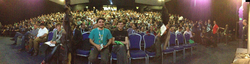

<h1> FOSS4G UK 2018 </h1>

On the 9th to 10th of March 2018, OSGeo:UK will be bringing together all those interested in free and open source geospatial software for FOSS4G UK 2018. The format and agenda is to be announced, but we're hoping to make it a great event! 

### We Need Your Help!

The committee is now in place, but we are still looking for volunteers and also sponsors. Please contact Max Stephan if you are interested in hearing about the various sponsorship packages available.

# Committee 

The current committee line up is:

* **Chair** - James Milner (3D Repo)
* **Co-Chair** - Tom Chadwin (Northumberland National Park)
* **Events Coordinator** - Isabel Ulitzsch (Geovation)
* **Treasurer** - Steven Feldman (KnowWhere Consulting)
* **Swag Coordinator** - Sam Franklin (DeepSky Consulting)
* **Sponsor Coordinator** - Max Stephan (Geovation)
* **Workshop Coordinator** - Nick Bearman (Clear Mapping)
* **Party Planner** - Dennis Bauszus

* **Code Sprint Coordinators** - Dennis Bauszus / Tom Chadwin / James Milner

### What

Conference format to be confirmed, but expect something similar to [FOSS4G UK 2016]() (Southampton), and/or [FOSS4G 2013, Nottingham](http://2013.foss4g.org/) only somewhat smaller.

### When

#### Conference 
* 8th - 9th of March 2018 (Thursday and Friday)

#### Codesprint (To be confirmed)
* 10th of March 2018 (Saturday)

### Where

The Geovation Hub
1 Sekforde Street
Clerkenwell Green
London
EC1R 0BE

<iframe src="https://a.tiles.mapbox.com/v4/ordnancesurvey.m41j649p/zoompan.html?access_token=pk.eyJ1Ijoib3JkbmFuY2VzdXJ2ZXkiLCJhIjoicmR0dXZkQSJ9.aERX_Ol_wRfwgC2Onl9__g#17/51.52377/-0.10425" width="100%" height="350px" style="border: none; padding-bottom: 30px;"></iframe>

### Getting There

#### Getting to London 
* ~2hrs 10mins from Manchester by train
* ~1hr 30mins from Birmingham by train
* ~3hrs 40mins from Cardiff by train
* ~1hr 25min flight from Edinburgh to London Stansted

#### Getting to the Geovation Hub
* ~7 minute walk from Farringdon Tube Station
* ~17 minute walk from Chancery Lane Tube Station
* ~19 minute walk from Angel Tube Station 

### Registration

To be announced

### Accommodation and Party

To be announced 

### Code Sprint

As it stands we currently have a proposed venue that we will annouce in the next month or so upon confirmation. 

### [Sponsorship](sponsors.html)

We want to keep the cost of entry to FOSS4GUK as low as possible, whilst also providing a quality event - sponsorship will help us to do that. If you are interested in sponsoring FOSS4GUK, there are opportunities for the smallest to the largest companies, and even for one man bands. 

<!-- ### Students

Thanks to the generosity of the AGI and our other sponsors we have some free places available for students.  If you would like to attend FOSS4GUK mail the team at osgeouk@gmail.com with the subject 'Student Bursary' telling them: 

 * The details of your current course of study
 * Why you want to attend FOSS4G UK?
 * Day 1, Day 2 or both?
 * Are you prepared to offer a small amount of time to help the organisers?

**Confirm that you can meet your own travel and accommodation costs - FOSS4GUK will pay the delegate fee, lunches and attendance at the party on Tuesday night** -->

### Code of Conduct
Participants at FOSS4G UK 2018 are expected to act respectfully toward others in accordance with the [OSGeo Code of Conduct](http://www.osgeo.org/code_of_conduct).

### Contact

For updates follow [@osgeouk on Twitter](https://twitter.com/osgeouk).

### Donate

Help us support and promote the use of open source geospatial software within the UK by donating via PayPal using the button below:

<form action="https://www.paypal.com/cgi-bin/webscr" method="post" target="_top">
<input type="hidden" name="cmd" value="_s-xclick">
<input type="hidden" name="hosted_button_id" value="42G7PKK5YV6NU">
<input type="image" src="https://www.paypalobjects.com/en_US/GB/i/btn/btn_donateCC_LG.gif" border="0" name="submit" alt="PayPal – The safer, easier way to pay online.">

</form>

